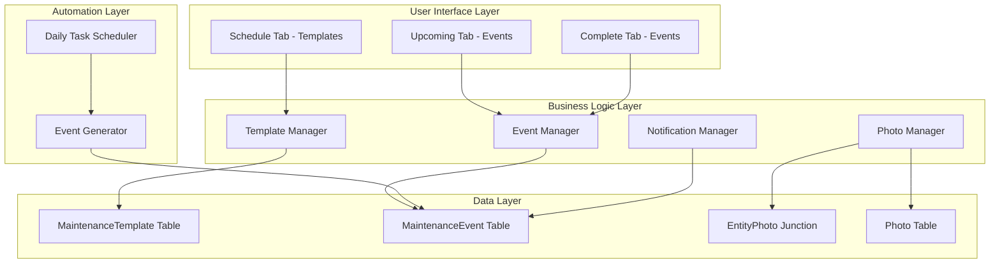
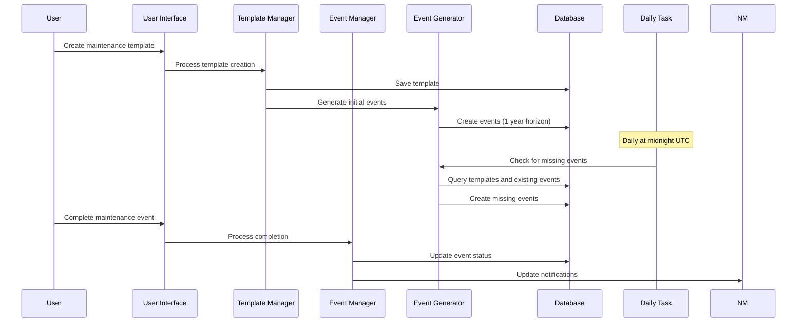

# Design Document

## Overview

The Maintenance System Restructure transforms the existing maintenance functionality from a simple task-completion model to a sophisticated template-based scheduling system. This design separates recurring maintenance definitions (templates) from individual maintenance occurrences (events), enabling better organization, automated scheduling, and improved photo management.

The system introduces three distinct user interface tabs: Schedule (for managing recurring templates), Upcoming (for pending maintenance events), and Complete (for finished maintenance events). A daily backend automation process maintains a rolling one-year horizon of scheduled maintenance events.

## Architecture

### High-Level Architecture



### Component Interaction Flow



## Components and Interfaces

### Template Manager Component

**Responsibilities:**
- Create, read, update, delete maintenance templates
- Validate template data and recurrence schedules
- Handle template photo attachments
- Coordinate with Event Generator for schedule changes

**Key Methods:**
```typescript
interface TemplateManager {
  createTemplate(template: MaintenanceTemplateInput): Promise<MaintenanceTemplate>
  updateTemplate(id: string, updates: Partial<MaintenanceTemplateInput>): Promise<MaintenanceTemplate>
  deleteTemplate(id: string): Promise<void>
  getTemplatesByBoat(boatId: string): Promise<MaintenanceTemplate[]>
  previewScheduleChanges(templateId: string, newSchedule: RecurrenceSchedule): Promise<ScheduleChangePreview>
  applyScheduleChanges(templateId: string, newSchedule: RecurrenceSchedule): Promise<void>
}
```

### Event Manager Component

**Responsibilities:**
- Manage maintenance event lifecycle
- Handle event completion and photo attachments
- Provide event filtering and sorting
- Coordinate with notification system

**Key Methods:**
```typescript
interface EventManager {
  getUpcomingEvents(boatId?: string): Promise<MaintenanceEvent[]>
  getCompletedEvents(boatId?: string): Promise<MaintenanceEvent[]>
  completeEvent(eventId: string, completion: EventCompletion): Promise<MaintenanceEvent>
  getEventDetails(eventId: string): Promise<MaintenanceEventDetails>
  updateEventDueDate(eventId: string, newDueDate: Date): Promise<MaintenanceEvent>
}
```

### Event Generator Component

**Responsibilities:**
- Generate maintenance events from templates
- Maintain one-year horizon of events
- Handle recurrence calculations
- Process bulk event updates

**Key Methods:**
```typescript
interface EventGenerator {
  generateEventsForTemplate(templateId: string, horizon: Date): Promise<MaintenanceEvent[]>
  generateMissingEvents(): Promise<GenerationReport>
  updateFutureEvents(templateId: string, changes: TemplateChanges): Promise<UpdateReport>
  calculateNextDueDate(lastDueDate: Date, recurrence: RecurrenceSchedule): Date
}
```

### Photo Manager Component

**Responsibilities:**
- Handle template and completion photo uploads
- Manage photo categorization
- Provide photo retrieval for events and templates
- Handle photo deletion and cleanup

**Key Methods:**
```typescript
interface PhotoManager {
  attachTemplatePhoto(templateId: string, photo: PhotoUpload): Promise<Photo>
  attachCompletionPhoto(eventId: string, photo: PhotoUpload): Promise<Photo>
  getTemplatePhotos(templateId: string): Promise<Photo[]>
  getCompletionPhotos(eventId: string): Promise<Photo[]>
  removePhoto(photoId: string): Promise<void>
}
```

## Data Models

### MaintenanceTemplate Model

```typescript
interface MaintenanceTemplate {
  id: string
  boatId: string
  title: string
  description: string
  component: string
  recurrence: RecurrenceSchedule
  estimatedCost: number
  estimatedTimeHours: number
  isActive: boolean
  createdAt: Date
  updatedAt: Date
  
  // Relationships
  boat: Boat
  events: MaintenanceEvent[]
  photos: Photo[]
}

interface RecurrenceSchedule {
  type: 'days' | 'weeks' | 'months' | 'years' | 'engine_hours'
  interval: number
}
```

### MaintenanceEvent Model

```typescript
interface MaintenanceEvent {
  id: string
  templateId: string
  boatId: string
  title: string
  description: string
  component: string
  estimatedCost: number
  estimatedTimeHours: number
  dueDate: Date
  completedAt: Date | null
  actualCost: number | null
  actualTimeHours: number | null
  completionNotes: string | null
  createdAt: Date
  updatedAt: Date
  
  // Relationships
  template: MaintenanceTemplate
  boat: Boat
  completionPhotos: Photo[]
}
```

### Database Schema Changes

```sql
-- New MaintenanceTemplate table
CREATE TABLE MaintenanceTemplate (
  id UUID PRIMARY KEY DEFAULT gen_random_uuid(),
  boatId UUID NOT NULL REFERENCES Boat(id) ON DELETE CASCADE,
  title VARCHAR(255) NOT NULL,
  description TEXT,
  component VARCHAR(255),
  recurrence JSONB NOT NULL,
  estimatedCost DECIMAL(10,2),
  estimatedTimeHours DECIMAL(5,2),
  isActive BOOLEAN DEFAULT true,
  createdAt TIMESTAMP DEFAULT NOW(),
  updatedAt TIMESTAMP DEFAULT NOW()
);

-- New MaintenanceEvent table
CREATE TABLE MaintenanceEvent (
  id UUID PRIMARY KEY DEFAULT gen_random_uuid(),
  templateId UUID NOT NULL REFERENCES MaintenanceTemplate(id) ON DELETE CASCADE,
  boatId UUID NOT NULL REFERENCES Boat(id) ON DELETE CASCADE,
  title VARCHAR(255) NOT NULL,
  description TEXT,
  component VARCHAR(255),
  estimatedCost DECIMAL(10,2),
  estimatedTimeHours DECIMAL(5,2),
  dueDate TIMESTAMP NOT NULL,
  completedAt TIMESTAMP,
  actualCost DECIMAL(10,2),
  actualTimeHours DECIMAL(5,2),
  completionNotes TEXT,
  createdAt TIMESTAMP DEFAULT NOW(),
  updatedAt TIMESTAMP DEFAULT NOW()
);

-- Indexes for performance
CREATE INDEX idx_maintenance_template_boat ON MaintenanceTemplate(boatId);
CREATE INDEX idx_maintenance_template_active ON MaintenanceTemplate(isActive);
CREATE INDEX idx_maintenance_event_template ON MaintenanceEvent(templateId);
CREATE INDEX idx_maintenance_event_boat ON MaintenanceEvent(boatId);
CREATE INDEX idx_maintenance_event_due_date ON MaintenanceEvent(dueDate);
CREATE INDEX idx_maintenance_event_completed ON MaintenanceEvent(completedAt);

-- Drop old tables
DROP TABLE MaintenanceCompletion;
DROP TABLE MaintenanceTask;
```

## Correctness Properties

*A property is a characteristic or behavior that should hold true across all valid executions of a system-essentially, a formal statement about what the system should do. Properties serve as the bridge between human-readable specifications and machine-verifiable correctness guarantees.*

Property 1: Template creation validation
*For any* maintenance template creation request, the system should accept templates with all required fields (boat, title, description, component, recurrence, estimated cost, estimated time) and reject templates missing any required field
**Validates: Requirements 1.1**

Property 2: Template photo attachment
*For any* maintenance template and photo, attaching the photo to the template should result in the photo being properly associated with that template
**Validates: Requirements 1.2**

Property 3: Schedule tab template display
*For any* set of maintenance templates, the Schedule tab should display all templates with their recurrence information
**Validates: Requirements 1.3**

Property 4: Template detail completeness
*For any* maintenance template, viewing the template details should display all template fields including title, description, component, recurrence, estimated cost, estimated time, and template photos
**Validates: Requirements 1.4**

Property 5: Template field editing
*For any* maintenance template and field modification, editing template fields should result in the changes being saved and reflected in the template
**Validates: Requirements 1.5**

Property 6: Template cascade deletion
*For any* maintenance template with associated future events, deleting the template should remove both the template and all its future maintenance events
**Validates: Requirements 1.6**

Property 7: Event generation from template
*For any* maintenance template with a recurrence schedule, creating the template should generate the correct number of maintenance events within the one-year horizon based on the recurrence pattern
**Validates: Requirements 2.1**

Property 8: Daily task event maintenance
*For any* active maintenance templates, running the daily maintenance task should create new events to maintain the one-year horizon for all templates
**Validates: Requirements 2.2**

Property 9: Template data copying to events
*For any* maintenance event generated from a template, the event should contain the same title, description, component, estimated cost, and estimated time as the originating template
**Validates: Requirements 2.3**

Property 10: Due date calculation accuracy
*For any* maintenance template with a recurrence schedule, generated events should have due dates calculated correctly based on the recurrence pattern
**Validates: Requirements 2.4**

Property 11: Event-template relationship integrity
*For any* maintenance event generated from a template, the event should maintain a proper reference link to its originating template
**Validates: Requirements 2.5**

Property 12: Upcoming events filtering
*For any* set of maintenance events, the Upcoming tab should display only events that are due but not completed
**Validates: Requirements 3.1**

Property 13: Completed events filtering
*For any* set of maintenance events, the Complete tab should display only events that have been completed
**Validates: Requirements 3.2**

Property 14: Event detail completeness
*For any* maintenance event, viewing the event details should display due date, template information, and completion status
**Validates: Requirements 3.3**

Property 15: Template photo visibility on events
*For any* maintenance event with an originating template that has photos, viewing the event should display the template photos as reference images
**Validates: Requirements 3.4**

Property 16: Event completion data recording
*For any* maintenance event completion, the system should properly record completion date, actual cost, completion notes, and completion photos
**Validates: Requirements 3.5**

Property 17: Completed event photo display
*For any* completed maintenance event, viewing the event should display both template photos and completion photos
**Validates: Requirements 3.6**

Property 18: Tab content filtering consistency
*For any* maintenance interface state, the Schedule tab should show only templates, Upcoming tab should show only incomplete events, and Complete tab should show only completed events
**Validates: Requirements 4.3, 4.4, 4.5**

Property 19: Event-template navigation links
*For any* maintenance event, viewing the event should provide a functional link to view the originating template
**Validates: Requirements 4.6, 8.1**

Property 20: Schedule change preview accuracy
*For any* template recurrence schedule change, the system should show a confirmation page listing all future events that will be affected by the change
**Validates: Requirements 5.1**

Property 21: Schedule change application
*For any* confirmed schedule change, the system should update all future maintenance events to match the new schedule while leaving past and completed events unchanged
**Validates: Requirements 5.2, 5.3**

Property 22: Template information propagation
*For any* template information change (title, description, component, estimated cost, estimated time), confirming the change should update all future events with the new template information while leaving completed events unchanged
**Validates: Requirements 6.1, 6.2, 6.3**

Property 23: Template photo propagation
*For any* template photo addition or removal, the changes should be visible on all future and existing events generated from that template
**Validates: Requirements 6.4, 7.5**

Property 24: Photo categorization accuracy
*For any* photo attached to a template, it should be categorized as a template photo, and for any photo attached to an event completion, it should be categorized as a completion photo
**Validates: Requirements 7.1, 7.3**

Property 25: Completion photo isolation
*For any* completion photo addition or removal, the changes should only affect the specific maintenance event and not other events
**Validates: Requirements 7.6**

Property 26: Navigation context preservation
*For any* navigation action between events and templates, the system should maintain context and provide appropriate back navigation to return users to the correct location
**Validates: Requirements 8.2, 8.3, 8.5**

Property 27: Daily task event detection
*For any* active maintenance templates, the daily task should correctly identify missing events within the one-year horizon and generate them based on the template's recurrence schedule
**Validates: Requirements 10.1, 10.2**

Property 28: Daily task logging and error handling
*For any* daily task execution, the system should log the number of events created and any errors encountered, and retry on the next execution if failures occur
**Validates: Requirements 10.3, 10.4**

Property 29: Template disable behavior
*For any* disabled maintenance template, the system should exclude it from daily event generation while preserving existing events
**Validates: Requirements 10.5**

Property 30: Offline change queuing and sync
*For any* template changes made offline, the system should queue the changes and sync them when connectivity returns, resolving conflicts using newest timestamp
**Validates: Requirements 11.1, 11.2, 11.3**

Property 31: Maintenance notification generation
*For any* maintenance event due within one week, the system should send notifications to both Android and Web applications with event title, due date, boat name, and event link
**Validates: Requirements 12.1, 12.2**

Property 32: Notification management
*For any* boat that is disabled, maintenance notifications for that boat's events should be suppressed, and when events are completed, notifications should be removed or marked as resolved
**Validates: Requirements 12.3, 12.4**

<function_calls>
<invoke name="prework">
<parameter name="featureName">maintenance-system-restructure

## Error Handling

### Template Management Errors

**Validation Errors:**
- Missing required fields (boat, title, recurrence)
- Invalid recurrence schedules
- Duplicate template names within the same boat
- Invalid estimated cost or time values

**Error Response:**
```typescript
interface ValidationError {
  field: string
  message: string
  code: 'REQUIRED' | 'INVALID_FORMAT' | 'DUPLICATE' | 'OUT_OF_RANGE'
}
```

### Event Generation Errors

**Generation Failures:**
- Invalid recurrence calculations
- Database constraint violations
- Insufficient system resources
- Template reference integrity issues

**Recovery Strategy:**
- Retry generation with exponential backoff
- Log detailed error information for debugging
- Continue processing other templates if one fails
- Notify administrators of persistent failures

### Synchronization Errors

**Offline Sync Issues:**
- Conflicting template changes
- Network connectivity failures
- Server unavailability
- Data corruption during sync

**Conflict Resolution:**
- Use newest timestamp for conflict resolution
- Preserve user data when possible
- Provide clear feedback about sync status
- Allow manual conflict resolution for critical cases

### Photo Management Errors

**Upload Failures:**
- File size exceeding limits
- Unsupported file formats
- Storage quota exceeded
- Network interruptions during upload

**Error Handling:**
- Retry uploads with exponential backoff
- Provide progress feedback during uploads
- Allow resumable uploads for large files
- Clear error messages for user action

## Testing Strategy

### Unit Testing Approach

**Template Manager Tests:**
- Template CRUD operations
- Validation logic for all fields
- Photo attachment and removal
- Schedule change calculations

**Event Manager Tests:**
- Event filtering and sorting
- Completion workflow
- Photo categorization
- Navigation state management

**Event Generator Tests:**
- Recurrence calculation algorithms
- One-year horizon maintenance
- Bulk event updates
- Error handling and recovery

### Property-Based Testing Requirements

**Testing Framework:** fast-check (JavaScript/TypeScript)
**Minimum Iterations:** 100 per property test
**Property Test Tagging:** Each test must include the comment format:
`**Feature: maintenance-system-restructure, Property {number}: {property_text}**`

**Key Property Test Areas:**

1. **Template Validation Properties (Properties 1-6):**
   - Generate random template data with missing/invalid fields
   - Test photo attachment with various file types and sizes
   - Verify cascade deletion behavior with complex template hierarchies

2. **Event Generation Properties (Properties 7-11):**
   - Test recurrence calculations with edge cases (leap years, month boundaries)
   - Verify event generation with various template configurations
   - Test daily task behavior with time simulation

3. **UI Filtering Properties (Properties 12-19):**
   - Generate mixed sets of completed/incomplete events
   - Test tab filtering with various event states
   - Verify navigation links with complex event hierarchies

4. **Change Propagation Properties (Properties 20-26):**
   - Test template changes with large numbers of future events
   - Verify photo propagation across event hierarchies
   - Test offline/online sync scenarios

5. **Automation Properties (Properties 27-32):**
   - Test daily task with various template states
   - Verify notification generation with complex scheduling
   - Test error handling and recovery scenarios

### Integration Testing

**End-to-End Workflows:**
- Complete template creation to event completion cycle
- Photo upload and display across template-event relationships
- Schedule change propagation through the entire system
- Offline-online synchronization scenarios

**Database Integration:**
- Transaction integrity during bulk operations
- Foreign key constraint enforcement
- Index performance with large datasets
- Migration from old to new schema

### Performance Testing

**Load Testing Scenarios:**
- Daily task performance with 1000+ templates
- Event generation for complex recurrence patterns
- Photo upload and retrieval performance
- Concurrent user access to maintenance data

**Scalability Considerations:**
- Database query optimization for large event sets
- Photo storage and retrieval efficiency
- Memory usage during bulk operations
- Network bandwidth for photo synchronization

### Manual Testing Checklist

**User Interface Testing:**
- Tab navigation and content filtering
- Template creation and editing workflows
- Event completion and photo attachment
- Navigation between events and templates
- Offline functionality and sync feedback

**Business Logic Verification:**
- Recurrence calculation accuracy
- Photo categorization and display
- Notification timing and content
- Schedule change impact assessment
- Data migration completeness

**Error Scenario Testing:**
- Network connectivity loss during operations
- Invalid data input handling
- Photo upload failures and recovery
- Database constraint violations
- Concurrent modification conflicts

This comprehensive testing strategy ensures the maintenance system restructure meets all correctness properties while maintaining system reliability and user experience quality.